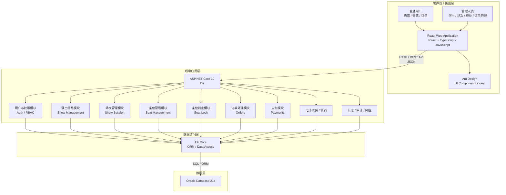
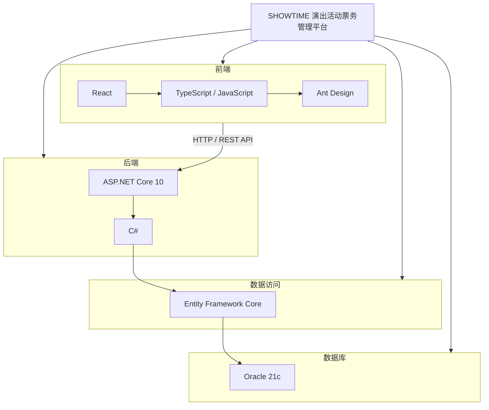
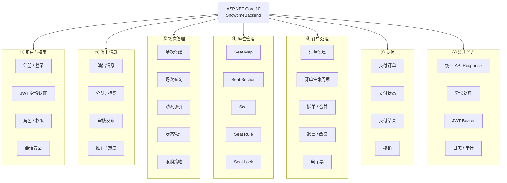
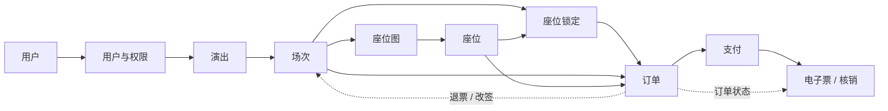
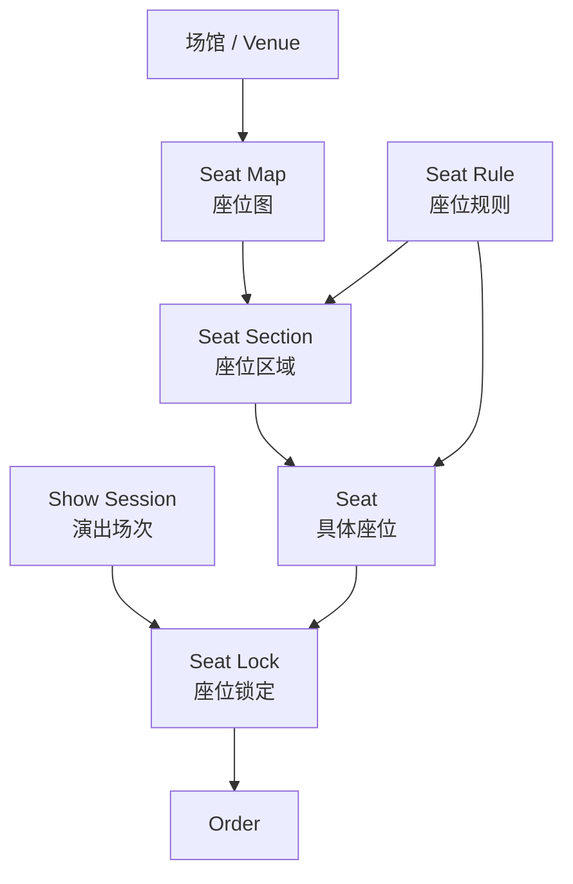
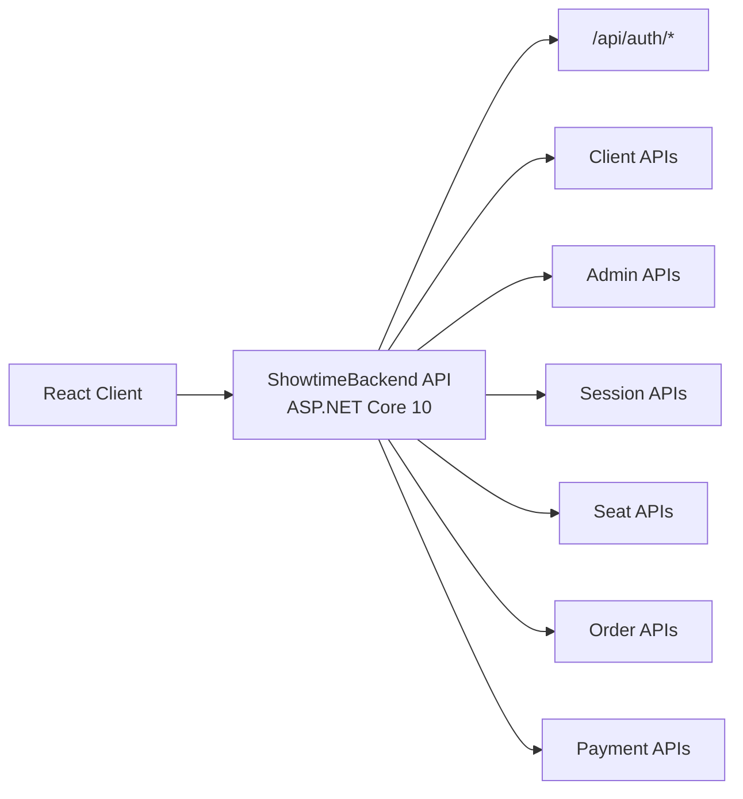
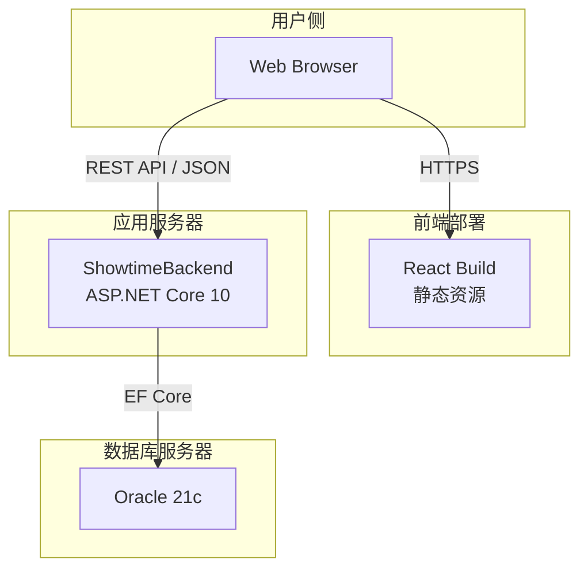
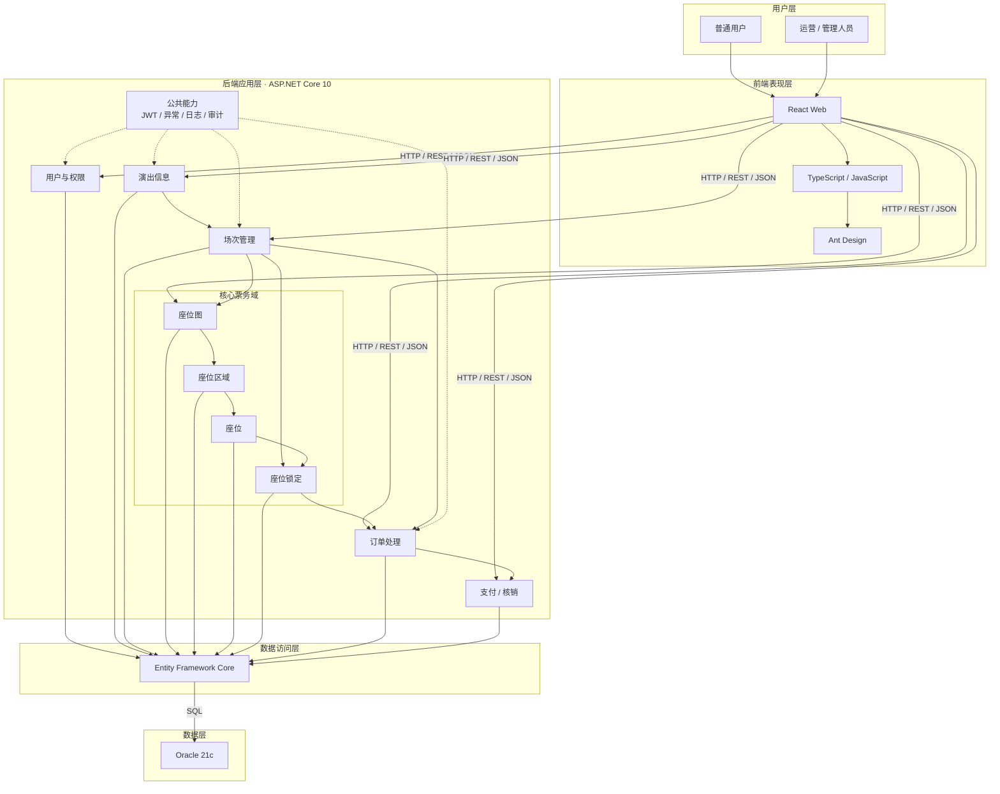

# SHOWTIME 系统总体架构

## 1. 系统架构概览

SHOWTIME 是一个面向演出活动的票务管理平台，系统采用前后端分离架构。前端基于 **React + TypeScript/JavaScript + Ant Design** 实现用户购票端和后台管理端；后端采用 **ASP.NET Core 10 + C#** 提供 RESTful API，并通过 **EF Core** 访问 **Oracle 21c** 数据库。README 中明确将用户权限、演出信息、场次、座位、订单、支付核销等作为核心业务领域；OpenAPI 则进一步体现了 Auth、ShowSession、Seat Locks、Seat Maps、Seat Rules、Seats、Orders、Payments 等 API 模块。

# 2. 技术栈架构

项目的核心技术栈可以分为四层：前端表现层、后端应用层、ORM 数据访问层和数据库层。

技术栈说明

| 层级     | 技术                    | 主要职责                 |
| -------- | ----------------------- | ------------------------ |
| 前端     | React                   | Web 页面与交互           |
| 前端语言 | TypeScript / JavaScript | 前端业务逻辑             |
| UI       | Ant Design              | 管理后台及业务组件       |
| 后端     | ASP.NET Core 10         | REST API、业务逻辑       |
| 后端语言 | C#                      | 后端业务实现             |
| ORM      | EF Core                 | 对象关系映射、数据库访问 |
| 数据库   | Oracle 21c              | 业务数据持久化           |

# 3. 后端模块划分

OpenAPI 中已经存在比较清晰的模块边界，例如 `Auth`、`ShowSessionClient`、`AdminShowSession`、`Seat Locks`、座位地图、座位规则、Seats、Orders 和 Payments 等

# 4. 业务模块关系

从业务角度来看，整个系统可以进一步抽象成下面的关系：

这个关系尤其适合在架构图中突出**票务核心链路**：

> **用户 → 演出 → 场次 → 座位 → 锁座 → 订单 → 支付 → 电子票 / 核销**

其中 OpenAPI 已经明确存在场次查询、场次创建、调价、状态更新以及座位锁定/释放接口。例如客户端可以根据 `showId` 查询场次，管理员可以创建场次和配置价格策略，同时座位锁定模块提供锁定和释放接口。

# 5. 座位管理模块内部架构

座位部分是整个票务系统比较重要的模块，建议单独表现。

OpenAPI 中目前已经明确区分了：

- Seat Maps
- Seat Rules
- Seat Sections
- Seats
- Seat Locks

这些并不是一个简单的“座位表”，而是具有层次关系的座位管理体系

其中 API 已经体现了 `seatMap → seatSection → seat` 的管理关系，例如存在针对 Seat Map 的 CRUD 操作，以及通过 `seatSectionId` 查询座位的接口。

# 6. API 层架构

因此 API 层可以抽象成：

# 7. 部署形态

(目前提供的文件没有明确说明 Nginx、Docker、Redis、消息队列、对象存储、Kubernetes、负载均衡等基础设施，因此架构图中不应该直接把这些技术画进去。)

# 8. 最终总架构图

## 9. 架构设计总结

整个系统可以概括为：

          				     ┌─────────────────────┐
                             │      用户 / 管理员    │
                             └──────────┬──────────┘
                                        │
                                        │ HTTPS
                                        ▼
                             ┌─────────────────────┐
                             │    React Web 前端    │
                             │ React + TS/JS + AntD│
                             └──────────┬──────────┘
                                        │
                                  REST API / JSON
                                        │
                                        ▼
                  ┌─────────────────────────────────────────┐
                  │          ASP.NET Core 10 API            │
                  │             ShowtimeBackend             │
                  │                                         │
                  │  Auth     Show      Session             │
                  │    │        │          │                │
                  │    └────────┼──────────┘                │
                  │             │                           │
                  │     Seat Map / Section / Seat           │
                  │             │                           │
                  │          Seat Lock                      │
                  │             │                           │
                  │           Order                         │
                  │             │                           │
                  │        Payment / Ticket                 │
                  └──────────────────┬──────────────────────┘
                                     │
                                  EF Core
                                     │
                                     ▼
                           ┌───────────────────┐
                           │    Oracle 21c     │
                           │   业务数据存储      │
                           └───────────────────┘

***最终架构定位***

| 维度                 | 当前项目定位                                  |
| -------------------- | --------------------------------------------- |
| 架构模式             | **前后端分离**                                |
| 后端模式             | **模块化单体**                                |
| 前端                 | React + TS/JS + Ant Design                    |
| 后端                 | ASP.NET Core 10 + C#                          |
| API                  | RESTful API / JSON                            |
| 认证                 | JWT Bearer                                    |
| ORM                  | EF Core                                       |
| 数据库               | Oracle 21c                                    |
| 核心业务域           | 用户权限、演出、场次、座位、订单、支付        |
| 核心票务链路         | 场次 → 座位 → 锁座 → 订单 → 支付              |
| 当前可确认部署       | Web 前端 + ASP.NET Core API + Oracle          |
| 暂不应在架构图中虚构 | Redis、MQ、Nginx、Docker、K8s、API Gateway 等 |
