# SHOWTIME 数据库设计说明

## 1. 数据库简介

SHOWTIME 数据库是演出票务管理系统的数据核心，主要负责存储和管理系统运行过程中的业务数据。

数据库覆盖以下核心业务：

- 用户与权限管理
- 演出信息管理
- 演出场次管理
- 场馆与座位管理
- 座位锁定
- 订单管理
- 支付与电子票管理

整个数据库围绕演出票务业务流程设计：

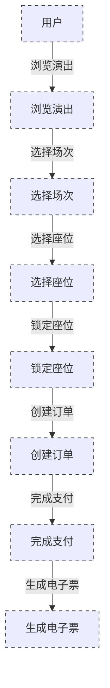

# 2. 数据库技术栈

| 类型       | 技术                  |
| ---------- | --------------------- |
| 数据库     | Oracle Database 21c   |
| 数据访问层 | Entity Framework Core |
| 后端框架   | ASP.NET Core 10       |
| 开发语言   | C#                    |
| 数据通信   | REST API + JSON       |
| 数据模型   | 关系型数据库          |

# 3. 数据库整体架构

整体数据库按照业务领域划分：

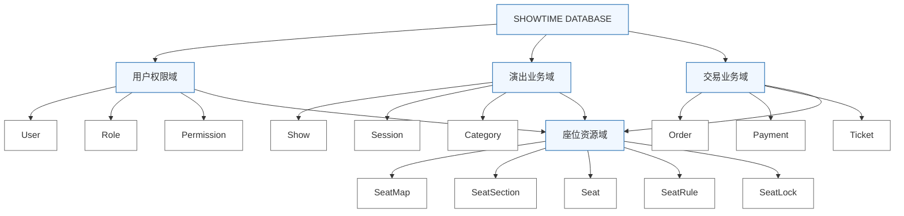

# 4. 数据库模块划分

## 4.1 用户权限模块

负责：

- 用户账号管理
- 登录认证
- 角色管理
- 权限控制

核心表：

| 表         | 作用           |
| ---------- | -------------- |
| User       | 保存用户信息   |
| Role       | 保存角色信息   |
| Permission | 保存权限信息   |
| UserRole   | 用户和角色关系 |

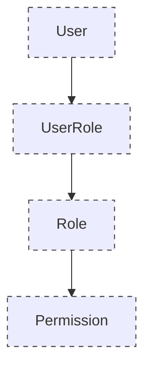

## 4.3 场次管理模块

负责：

- 演出时间安排
- 售票状态
- 场次价格

核心表：

| 表            | 作用     |
| ------------- | -------- |
| ShowSession   | 演出场次 |
| PriceRule     | 价格规则 |
| SessionStatus | 状态管理 |

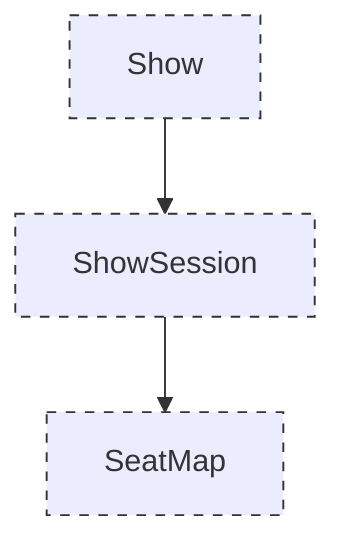


一个演出可以对应多个场次，每个场次拥有自己的座位库存。

## 4.4 座位资源模块

这是票务系统的核心模块。

负责：

- 座位布局
- 座位区域
- 座位状态
- 临时锁座

核心表：

| 表          | 作用         |
| ----------- | ------------ |
| SeatMap     | 座位布局     |
| SeatSection | 座位区域     |
| Seat        | 具体座位     |
| SeatRule    | 座位规则     |
| SeatLock    | 临时锁座记录 |

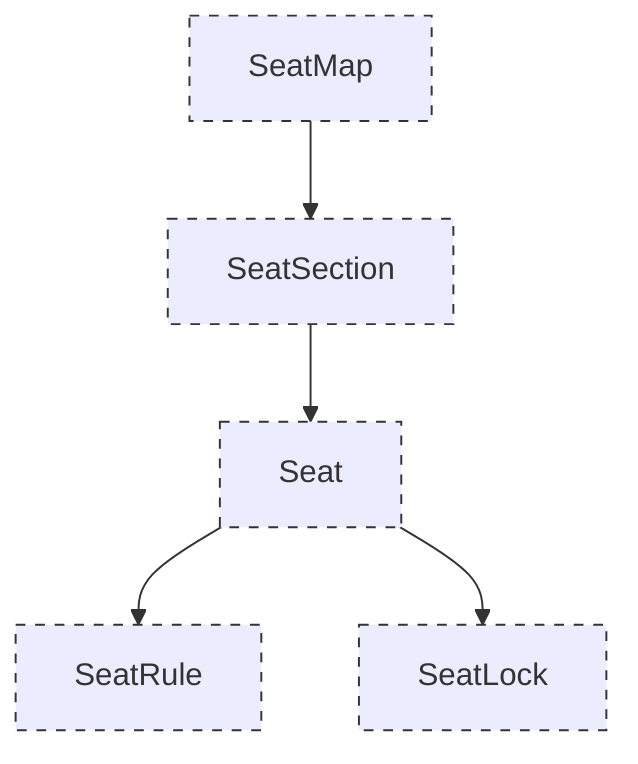

## 4.5 订单交易模块

负责：

- 创建订单
- 保存购买信息
- 订单状态管理
- 退票
- 改签

核心表：

| 表        | 作用     |
| --------- | -------- |
| Order     | 订单主表 |
| OrderItem | 商品明细 |
| Ticket    | 电子票   |
| Refund    | 退款记录 |

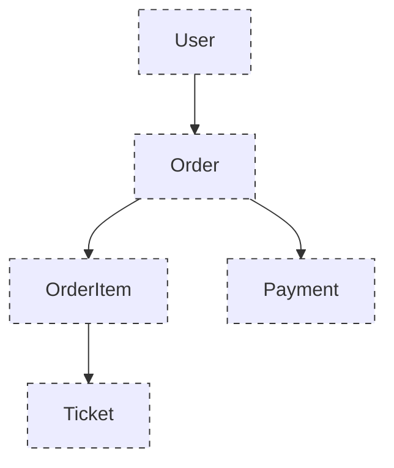

## 4.6 支付模块

负责：

- 支付请求
- 支付状态
- 支付结果
- 入场核销

核心表：

| 表           | 作用     |
| ------------ | -------- |
| Payment      | 支付记录 |
| Verification | 核销记录 |

# 5. 数据库核心业务流程

## 用户购票流程

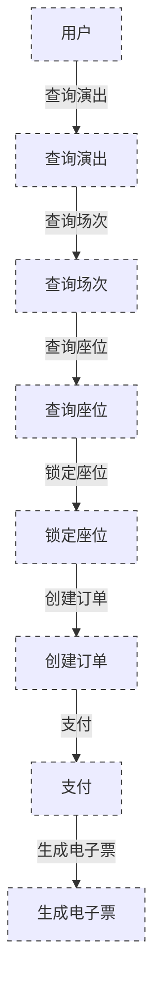


其中：

- SeatLock 防止多人同时购买同一个座位；
- Order 保存交易信息；
- Payment 保存支付结果；
- Ticket 作为最终入场凭证。

# 6. 数据库 ER 关系

整体关系：

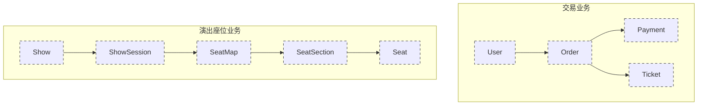


# 7. 数据库设计规范

## 表命名

采用 PascalCase：

例如：

```
Show

ShowSession

SeatLock

OrderItem
```

## 字段规范

| 类型     | 命名      |
| -------- | --------- |
| 主键     | Id        |
| 外键     | XxxId     |
| 创建时间 | CreatedAt |
| 修改时间 | UpdatedAt |
| 状态     | Status    |

例如：

```
ShowId

UserId

CreatedAt

Status
```

# 8. 索引设计

为了提高查询效率：

## 用户

```
User.Email

User.Username
```

## 演出

```
Show.CategoryId

Show.Status
```

## 场次

```
ShowSession.ShowId

ShowSession.StartTime
```

## 订单

```
Order.UserId

Order.Status

Order.CreatedAt
```

## 座位

```
Seat.SeatMapId

Seat.Status
```

# 9. 数据一致性设计

票务系统最重要的是保证座位一致性。

例如：

用户 A 和用户 B 同时购买同一个座位：

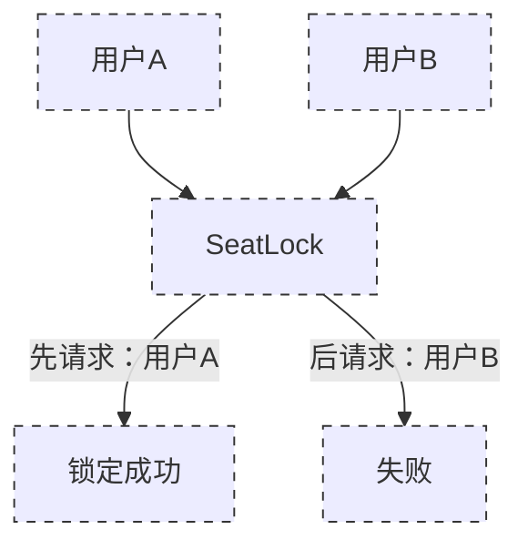


保证：

- 一个座位只能对应一个有效订单；
- 支付失败自动释放座位；
- 锁座超时自动恢复库存。

------

# 10. 事务设计

订单支付过程：

```
BEGIN TRANSACTION


1. 创建订单

2. 锁定座位

3. 创建支付记录

4. 更新订单状态


COMMIT
```

如果异常：

```
ROLLBACK

释放座位

取消订单
```

# 11. 数据库部署结构

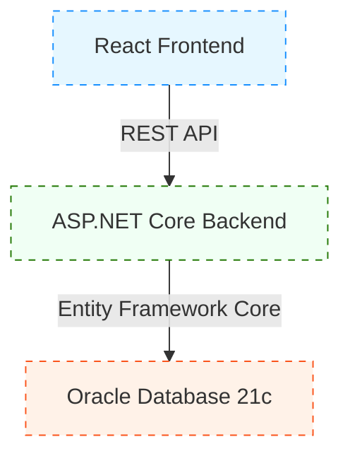

# 12. 数据初始化

建议数据库目录：

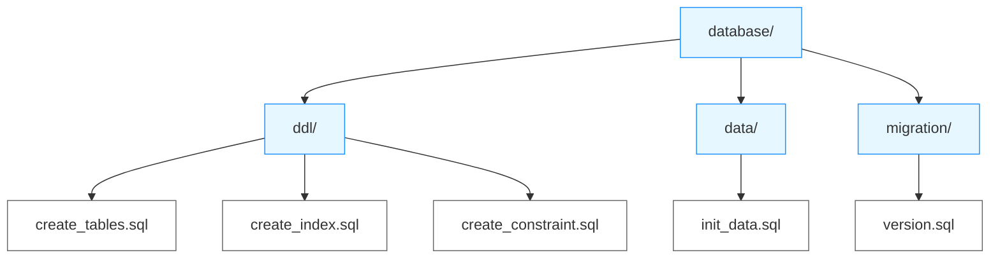


# 13. 数据库维护规范

建议：

- 不直接删除订单和支付记录；
- 重要数据采用状态变化；
- 保留业务历史；
- 定期备份数据库；
- 使用版本迁移管理结构变化。

# 总结

SHOWTIME 数据库采用面向业务领域的设计方式，将数据库划分为：

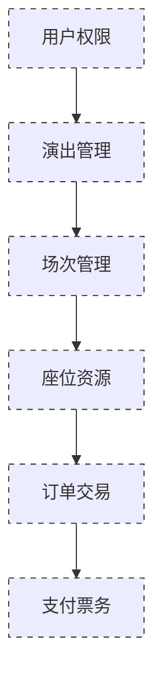


通过 Oracle 21c + Entity Framework Core + ASP.NET Core 10，为整个演出票务系统提供稳定的数据支撑。