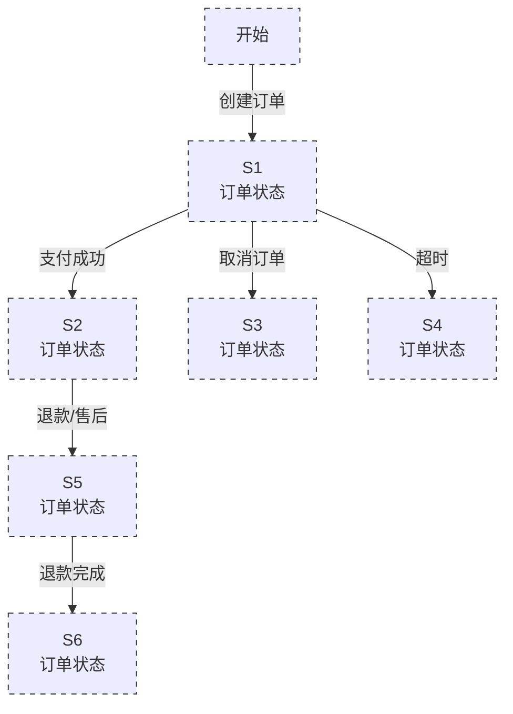
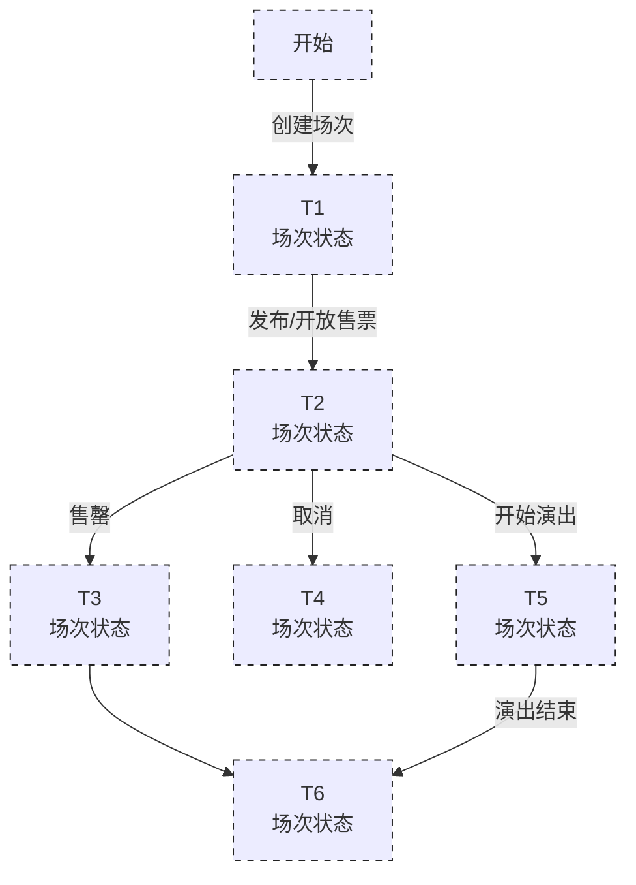

# 演出票务系统状态机设计

> **说明**
>
> 本文档依据当前 `openapi.json` 中已定义的订单、场次相关字段及接口进行状态机设计。
>
> 当前 OpenAPI 快照中，`orderStatus` 和 `sessionStatus` 均定义为 `string`，未给出具体状态枚举值。因此，本文暂以 `S1~S6`、`T1~T6` 作为状态占位符，待确认实际状态枚举及状态转换规则后替换。

---

## 1. 订单状态机

### 1.1 状态机图

### 1.2 状态说明

| 状态标识 | 含义 | 当前确认情况 |
|---|---|---|
| S1 | 初始订单状态 | 待后端确认具体枚举值 |
| S2 | 支付成功后的订单状态 | 待后端确认具体枚举值 |
| S3 | 取消后的订单状态 | 待后端确认具体枚举值 |
| S4 | 超时后的订单状态 | 待后端确认具体枚举值 |
| S5 | 退款/售后过程中的订单状态 | 待后端确认具体枚举值 |
| S6 | 退款完成后的订单状态 | 待后端确认具体枚举值 |

### 1.3 相关接口依据

当前 OpenAPI 中可以确认：

- `POST /api/orders`：创建订单。
- `PATCH /api/orders/{orderId}/cancel`：取消订单。
- `GET /api/orders/{orderId}/payments`：查询订单支付信息。
- `POST /api/orders/{orderId}/payments/mock`：进行模拟支付相关操作。
- 订单响应模型包含 `orderStatus`、`expireTime`、`payTime`、`cancelTime` 等字段。

> **注意：** OpenAPI 未直接给出 `S1~S6` 对应的真实状态名称，也未完整定义所有状态转换规则。因此，退款、超时等状态转换在最终版本中需要结合后端业务代码进一步确认。

---

## 2. 场次状态机

### 2.1 状态机图

### 2.2 状态说明

| 状态标识 | 含义 | 当前确认情况 |
|---|---|---|
| T1 | 场次初始状态 | 待后端确认具体枚举值 |
| T2 | 开放售票后的场次状态 | 待后端确认具体枚举值 |
| T3 | 售罄状态 | 待后端确认具体枚举值 |
| T4 | 取消状态 | 待后端确认具体枚举值 |
| T5 | 演出进行中的状态 | 待后端确认具体枚举值 |
| T6 | 演出结束状态 | 待后端确认具体枚举值 |

### 2.3 相关接口依据

当前 OpenAPI 中可以确认：

- 场次模型包含 `sessionStatus`。
- `PUT /api/admin/sessions/{sessionId}/status`：修改场次状态。
- `UpdateSessionStatusRequest` 中包含 `status` 字段。
- 场次模型还包含 `startTime`、`endTime`、`saleStartTime`、`saleEndTime` 等时间字段。

>  OpenAPI 中 `sessionStatus` 和状态修改请求中的 `status` 均为 `string`，没有提供具体枚举值。因此，`T1~T6` 为当前设计占位符，正式版本需要根据后端实际状态枚举进行替换。

---

## 3. 待确认事项

| 编号 | 待确认内容 |
|---|---|---|
| 1 | `OrderStatus` 的完整状态枚举 |
| 2 | 订单各状态之间的合法转换关系 |
| 3 | `SessionStatus` 的完整状态枚举 | 
| 4 | 场次各状态之间的合法转换关系 |
| 5 | 订单超时是否对应独立状态 |
| 6 | 售罄是否作为独立场次状态，还是由库存状态表示 | 
| 7 | 退款是否属于订单状态，还是独立的售后流程 | 

---

